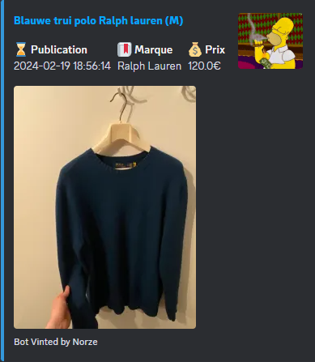

# **🩳 VINTED WEBHOOK**

## **⚙️ Requirements / Launch**

- [Python 3](https://www.python.org/downloads/release/python-370/)
```
$ git clone https://github.com/N0rz3/Vinted-webhook.git
$ cd Vinted-webhook\bot
$ pip install -r requirements.txt
```


### **📚 Example :**
```
python main.py
```

# 📷 **Result**



## **📝 License**

[GNU General Public License v3](https://www.gnu.org/licenses/gpl-3.0.fr.html)


Do you like what I offer as content ? Subscribe to my GitHub account for more tools and programs ! 😉